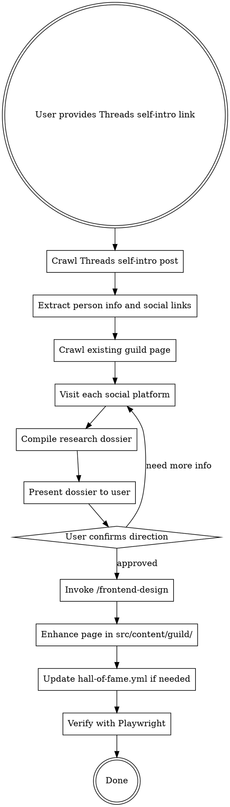

# Guild Member Research & Profile Enhancement

## Overview

User provides a Threads self-intro link → crawl it with Playwright → follow social links to deep-research the person → compile dossier → enhance the existing guild page (built by Google Jules) using `/frontend-design`. Each page must be **one-of-a-kind**.

## Workflow



## Phase 1: Reconnaissance

### Step 1 — Crawl Threads 自我介紹

User 會提供一個 Threads 自介貼文連結，這是最重要的第一手資料。

用 Playwright 爬取該貼文：

1. 導航到 user 提供的 Threads 連結
2. 截圖留存
3. 擷取完整貼文內容（文字）：
   - 職業 / 背景
   - 人生故事、轉職經歷、轉折點
   - 興趣 / 熱情所在
   - 價值觀和信念
   - 任何提到的社群連結（IG、LinkedIn、GitHub 等）
4. 也查看該貼文下方的**回覆和互動**，可能有更多自我揭露
5. 進入此人的 Threads 個人頁面，瀏覽其他貼文，補充人物畫像：
   - 日常分享的主題
   - 回覆別人的語氣和風格
   - 關注的話題和社群

**這一步是整個研究的基石** — Threads 自介是成員在社群脈絡下的主動分享，通常最真實、最有深度。

### Step 2 — 爬取現有 Guild 頁面

成員頁面通常已由 Google Jules 建立初版，存在於 `src/content/guild/{member}.html`。

用 Playwright 檢視現有頁面：

1. 導航到 `http://localhost:4321/guild/{member}/`
2. 截取完整頁面截圖
3. 提取所有連結（`<a href>`）— 特別是社群連結
4. 記錄現有的：設計主題、配色、動畫技術、內容區塊
5. 評估哪些部分可以保留、哪些需要強化

```
社群平台清單：
- Threads (threads.net)
- Instagram (instagram.com)
- Twitter/X (x.com)
- Facebook (facebook.com)
- LinkedIn (linkedin.com)
- GitHub (github.com)
- YouTube (youtube.com)
- Medium, 個人部落格
- 個人網站
- Discord
- 其他
```

### Step 3 — Deep-dive 社群檔案

#### Threads（必做，用 Playwright）

從 Step 1 取得的 Threads 個人頁面，進一步深挖：

1. 瀏覽此人的貼文歷史，盡量多看
2. 截圖重要貼文
3. 提取：
   - **近期貼文**（主題、話題、風格）
   - **內容模式** — 他們都在聊什麼？
   - **興趣與熱情** — 從內容中推斷
   - **個性特質** — 寫作語氣、幽默風格、價值觀
   - **成就** — 認證、獎項、里程碑
   - **社群歸屬** — 參與的團體、運動、社群
   - **和其他成員的互動** — 回覆、轉發、tag

#### 其他平台（必做，Playwright 或 WebFetch）

對其他社群連結（IG、LinkedIn、GitHub 等）都要去抓，工具選擇：
- **優先用 WebFetch** — 輕量快速，適合大部分公開頁面
- **需要 JS 渲染或互動時改用 Playwright** — 例如需要滾動載入更多內容、點擊展開等
- **兩者都被擋時** → 記錄下來，請 user 手動提供資訊

提取：
   - **Bio/簡介** 文字
   - **視覺風格** — 偏好的顏色、美學
   - **專業資訊** — 職稱、公司、技能
   - **近期活動** — 最近在做什麼
   - **作品集 / 專案** — GitHub repos、Portfolio 等

### Step 4 — 整理研究檔案

組織所有發現為結構化摘要：

```markdown
## Research Dossier: {Name}

### Identity
- 名字 / 暱稱
- 目前職業 / 角色
- 所在地（若公開）

### Threads 自介（核心資料）
- 自介貼文原文摘錄
- 提到的職業/背景
- 分享的人生故事或轉折
- 表達的價值觀和信念
- 互動風格（從回覆觀察）

### Online Presence
- Platform 1: [link] — 活動摘要
- Platform 2: [link] — 活動摘要

### Key Themes & Interests
- 主題 1（附證據）
- 主題 2（附證據）

### Personality Profile
- 溝通風格
- 價值觀與信念
- 幽默 / 語氣

### Visual Preferences
- 偏好的顏色
- 美學風格

### Story Arc
- 背景 / 起源
- 現在進行式
- 未來願景（若可見）

### Current Page Assessment
- Jules 初版的優點
- 可以強化的方向
- 缺少的元素

### Enhancement Proposals
- 建議的主題/概念
- 值得引用的金句
- 視覺母題
- 符合其個性的互動創意
```

**將此檔案呈給 user 確認後才進入設計階段。**

## Phase 2: Design & Enhancement

### Step 5 — Invoke /frontend-design

User 確認研究方向後，呼叫 `/frontend-design` skill，提供：

- 完整研究檔案
- 現有頁面的截圖和程式碼（Jules 初版）
- 獨特性要求：**不能和其他 guild 頁面撞主題**

**Guild 頁面設計原則：**
- 每頁是獨立 HTML 檔案，位於 `src/content/guild/{member}.html`
- 樣式用 inline `<style>`（不使用外部 CSS，library 除外）
- GSAP + ScrollTrigger 是基本動畫庫
- 進階頁面可用 PixiJS、Three.js、Babylon.js
- 必須有返回導航：`<a href="/guild/">← ARCHIVE</a>`（或類似）
- 頭像路徑：`/assets/img/guild/{member}/avatar.webp`
- Footer 放社群連結
- 響應式設計（手機友善）
- Footer 署名：「Made with ♥ by SuperGalen's Dungeon」
- **主題必須深度反映這個人是誰**

### Step 6 — 實作

1. 基於 Jules 初版強化 `src/content/guild/{member}.html`
2. 確認頭像存在於 `/public/assets/img/guild/{member}/avatar.webp`
3. 如為新成員，更新 `/src/data/hall-of-fame.yml`：
   ```yaml
   - id: "{unique_id}"
     name: "Display Name"
     avatar: "/assets/img/guild/{member}/avatar.webp"
     page: "/guild/{member}.html"
     tags:
       - id: "tag_id"
         label: "Tag Label"
   ```

### Step 7 — 驗證

用 Playwright：
1. 導航到頁面
2. 在關鍵滾動位置截圖
3. 驗證所有連結正常
4. 檢查手機版響應式（375px）
5. 呈給 user 做最終確認

## Important Notes

- **隱私優先**：只用公開資訊，絕不放私人資料
- **不寫具體追蹤者數字**：頁面上禁止出現具體的追蹤者/粉絲數量（如「396 followers」）。這些數字會隨時間變動，寫死在頁面上會過時且尷尬。改用非量化的描述（如「活躍經營中」）或完全省略
- **先問再做**：研究結果必須先給 user 確認，再進設計
- **獨特性為王**：先看其他 guild 頁面，避免撞主題
- **品質優先**：這些頁面是送給成員的禮物，要用心做
- **基於初版強化**：Jules 已建初版，我們是在其基礎上深化和提升，不是從零開始

## Quick Reference

| File | Purpose |
|------|---------|
| `src/content/guild/{member}.html` | 成員頁面 HTML |
| `public/assets/img/guild/{member}/avatar.webp` | 頭像圖片 |
| `src/data/hall-of-fame.yml` | 成員註冊表 |
| `src/pages/guild/[member].astro` | 動態路由模板 |
| `src/pages/guild/index.astro` | Guild 首頁 |

## Common Mistakes

| Mistake | Fix |
|---------|-----|
| 跳過 Threads 自介研究 | 自介是核心，絕不能省 |
| 沒有先爬 Jules 初版 | 要知道現有基礎才能有效強化 |
| 沒呈 dossier 就開始設計 | 一定要 user 確認方向 |
| 抄別人的 guild 頁面主題 | 先研究對方，設計圍繞 THEM |
| 用外部 CSS 檔案 | 樣式保持 inline |
| 忘記手機響應式 | 最少測 375px 寬度 |
| 漏掉返回導航連結 | 一定要有 `← ARCHIVE` 回 `/guild/` |
| 沒更新 hall-of-fame.yml | 新成員需要 YAML 條目 |
| 寫具體追蹤者/粉絲數字 | 數字會過時，用非量化描述或省略 |
